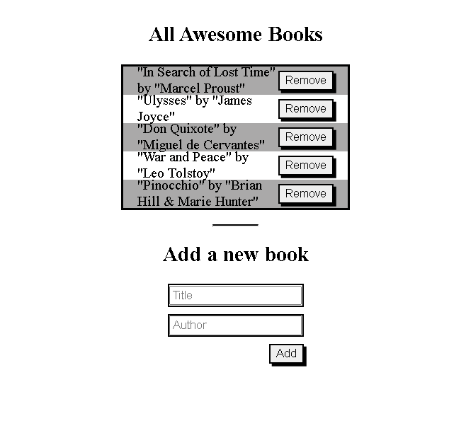
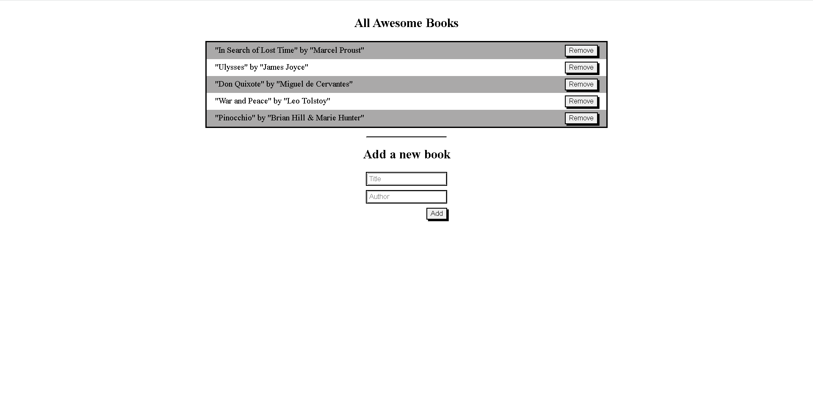

# "Awesome books: plain JavaScript with objects"

> This is a basic mobile & desktop website that allows users to ADD and REMOVE books from a list.

 

Additional description about the project and its features.

## Built With

- HTML
- CSS
- JS
- Linters

## Live Demo

[Live Demo Link](https://saidrasinlic.github.io/AwesomeBooks/)

## Getting Started

To get a local copy up and running follow these simple example steps.

### Prerequisites

- GitHub/VSCode/Linters

### Setup

- gh repo clone SaidRasinlic/AwesomeBooks

## Authors

👤 **Author1**

- GitHub: [@GitHub/SaidRasinlic](https://twitter.com/SaidRasinlic)
- Twitter: [@Twitter/SaidRasinlic](https://twitter.com/SaidRasinlic)
- LinkedIn: [LinkedIn/SaidRasinlic](https://www.linkedin.com/in/saidrasinlic)

## 🤝 Contributing

Contributions, issues, and feature requests are welcome!

Feel free to check the [issues page](../../issues/).

## Show your support

Give a ⭐️ if you like this project!

## Acknowledgments

- Microverse 

## 📝 License

This project is [MIT](LICENSE) licensed.
